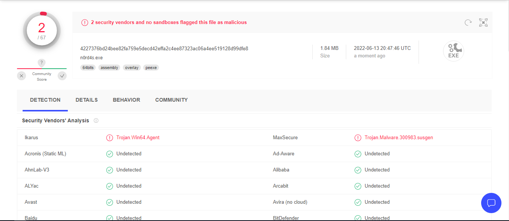

# What's AV Evasion
* Obfuscating (it can be reversed) or encrypting the payload at runtime, so that it gets decrypted on the fly and injected into memory.
# Screenshot Of VirusTotal

* link : https://www.virustotal.com/gui/file/4227376bd24bee82fa759e5decd42effa2c4ee87323ac06a4ee519128d99dfe8?nocache=1
